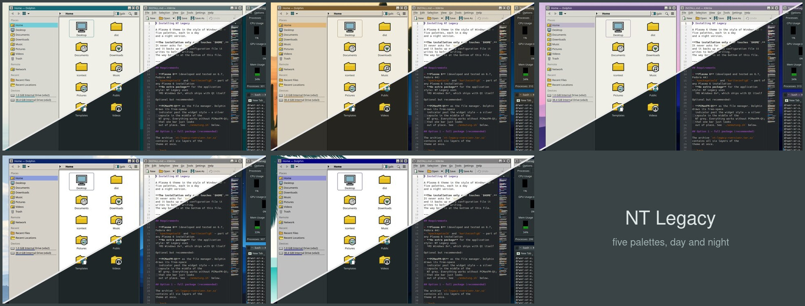
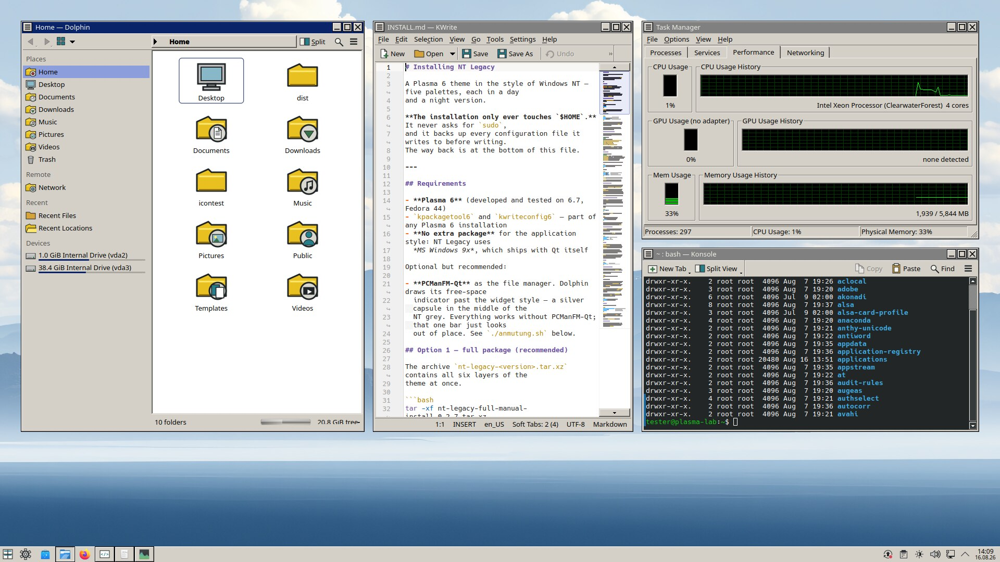
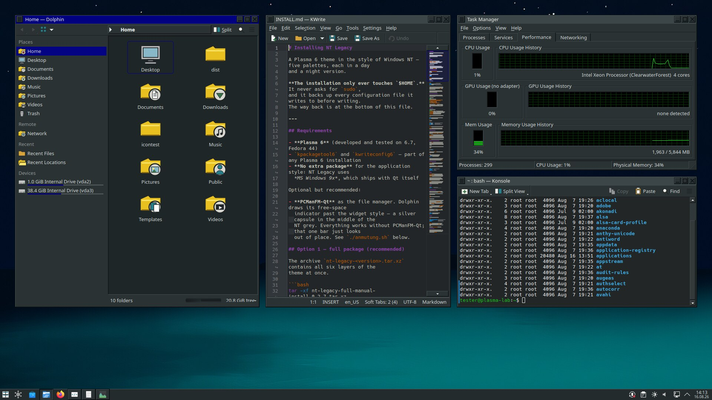

# NT Legacy

A Plasma 6 theme in the style of Windows NT — five palettes, each in a day
and a night version.



| | |
|---|---|
|  |  |
| *NT Legacy 2000* | *NT Legacy 98, night version* |

Each palette is generated from one set of colour values: the Plasma style,
the colour scheme, the Aurorae window decoration, the Konsole scheme and
the plain-gradient wallpaper. Change a value in `nt-legacy/build.py`, run
it, and every layer of that palette follows — that is the whole idea
behind this repository.

Two things do *not* vary by palette: the icon set and the cursors exist
once each in a light and a dark version, because ten near-identical sets
would only clutter the selection dialogs. And the *shapes* are global —
titlebar height, border widths, bevel or flat — they are arguments to the
generators in `tools/`, not part of a palette.

## Install

```bash
tar -xf nt-legacy-full-manual-install-<version>.tar.xz
cd nt-legacy
./install.sh --anwenden win2k     # install, then apply that version
```

The installation only ever touches `$HOME`, never asks for `sudo`, and
backs up every configuration file it writes to. Full instructions,
including the way back, are in **[nt-legacy/INSTALL.md](nt-legacy/INSTALL.md)**.

Releases are on the [KDE Store](https://store.kde.org/) and under
[Releases](../../releases).

## The ten versions

| Command | Display name | Palette |
|---|---|---|
| `./apply.sh` or `teal` | NT Legacy | petrol and warm grey — the base version |
| `./apply.sh lilac` | NT Legacy Flieder | lilac instead of petrol, after NT's *Lilac* |
| `./apply.sh desert` | NT Legacy Wüste | sand and terracotta, after NT's *Desert* |
| `./apply.sh win2k` | NT Legacy 2000 | softer grey, blue gradient |
| `./apply.sh win98` | NT Legacy 98 | system grey and navy blue |

Each also comes as a night version: `teal-nacht`, `lilac-nacht`,
`desert-nacht`, `win2k-nacht`, `win98-nacht`.

## Boot screens

GRUB and Plymouth get the same NT dialog as the Plasma splash, so the
machine looks the same from power-on to desktop:

```bash
./install-grub.sh win2k          # boot menu
./install-plymouth.sh win2k      # boot splash
./install-grub.sh --zurueck      # remove, restore what was there before
./install-plymouth.sh --zurueck
```

These two are **not** part of `install.sh`: they write to `/boot` and
`/usr` and need `sudo`, while everything else stays inside `$HOME`. Both
back up what they touch, and `--zurueck` restores it byte for byte.

Plymouth needs its script module, which Fedora and Nobara ship separately
(`sudo dnf install plymouth-plugin-script`); the installer checks. With an
encrypted disk, test the passphrase prompt before rebooting — see
[nt-legacy/INSTALL.md](nt-legacy/INSTALL.md).

## Building from source

```bash
cd nt-legacy
./build.py              # all ten versions
./build.py --nur win2k  # a single one
./build.py --pruefen    # and lint the generated SVGs
```

`build.py` calls the generators in `tools/`. Packaging for the store is
`tools/mach-paket.sh`; see [UPLOAD.md](UPLOAD.md) for what goes where.

The scripts and their comments are in German — that is where the
reasoning behind each decision is written down, and translating it would
have cost the detail. The user-facing documentation is English.

## Licence and provenance

GPL-2.0-or-later. The theme contains no third-party material: icons,
SVGs, window decoration and cursors are all generated from colour values;
the photographic wallpapers are rendered locally with FLUX.1-schnell
(Apache-2.0). Details in
[nt-legacy/ATTRIBUTION.md](nt-legacy/ATTRIBUTION.md).

Chicago95 is **not** included and never will be: it has no LICENSE file
and the provenance of its bitmaps is unclear. If you want those icons,
`./fetch-icons.sh` fetches and adapts them on your own machine.
